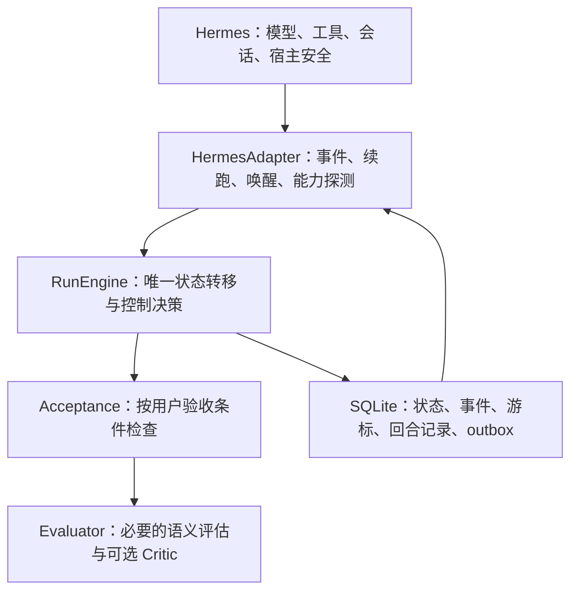

# Supergoal 架构复审与重构建议

评审对象：本地 `codex/generic-runtime` 候选，包含上一轮通用验收修正。用户确定的目标是：**跨小时或天持续推进一个有限目标，达成后停止**。

结论：需要结构性重构。保留 Hermes 插件接入、SQLite、稳定运行 ID、事务、CAS、工具账本和 outbox，重构控制与验收内核。上一轮移除交易规则是必要修正，尚不足以证明整体运行可靠。本轮是评审和方案，没有继续修改运行代码或生产环境。

## 判断标准

这里的“科学”应落实为可验证的工程性质：

1. 目标通用：任务方法与验收要求来自用户目标，核心不预置领域工作流。
2. 状态明确：任何事件之后，都能说明任务为何继续、等待、暂停或完成。
3. 完成可信：工具调用发生、工具成功、用户目标满足分别有证据。
4. 恢复可靠：重复回调、进程退出、会话压缩、取消和跨入口竞争不会改变任务语义。
5. 成本可控：没有新事实时不会持续生成回合，评估服务失效不会被当作任务尚未完成。
6. 可以证伪：用同一真实运行路径进行回放、故障注入和真实模型评测。

运行时可以保证预算、状态和恢复语义，不能保证所有任意目标最终成功。不可行任务必须有明确的暂停或终止原因。

## 可以保留的基础

| 已有设计 | 判断 | 保留条件 |
| --- | --- | --- |
| 稳定 `goal_run_id` 与物理 session 分开 | 合理 | 压缩、更换会话不改变任务身份 |
| SQLite + WAL + 事务 | 适合当前单机部署 | 控制写事务长度，验证并发与备份，不凭文件长度更换数据库 |
| 状态和续跑 outbox 一起提交 | 合理 | 补齐领取、重放和执行所有权语义 |
| CAS 防止旧结果覆盖用户暂停/清理 | 合理 | 所有权与幂等不能仅由 CAS 代替 |
| 助手自报与实际工具记录区分 | 方向合理 | 不能把一次调用自动升级为“验收通过” |
| 用插件包装 Hermes | 合理 | Hermes 继续负责工具执行、上下文、模型与宿主安全 |

outbox 解决状态与通知分别写入时的失败窗口，但消费者仍需处理重复消息，这与 [事务 outbox 模式](https://docs.aws.amazon.com/prescriptive-guidance/latest/cloud-design-patterns/transactional-outbox.html)一致。SQLite WAL 仍只有一个并发写者，适用判断取决于部署和写入负载，见 [SQLite 文档](https://www.sqlite.org/wal.html)。这些原则支持保留基础组件，不等于当前实现已具备完整可靠性。

## 实际问题和复现

以下复现全部使用临时数据库、合成工具结果和确定性 evaluator，没有调用真实模型或生产任务。结果保存在本机 `.git/nexus-query/architecture-probes-2026-10-04.json`。正向模拟 Judge 用于故意注入错误判定，检查确定性门禁能否拦截；它不代表测得真实模型误判率。

| 问题 | 当前证据 | 对架构的影响 |
| --- | --- | --- |
| 两套控制路径 | 插件调用 `RuntimeManager.after_turn`；`SupergoalController` 的调用方仅有其直接单测 | 生命周期与评估健康策略难以维持一致，另一条路径的单测不能证明生产行为 |
| 调用成功和目标验证混同 | `pytest` 返回 `exit_code=1`、`1 failed`，hook 外层状态为 `ok`，仍标记 `test_run/verified`；模拟 Judge=done 时 G3 通过、任务 done | 工具协议成功并不代表命令成功，更不代表用户验收通过 |
| 验收仅检查证据类型 | 目标是创建新报告，只读取旧的无关文件，`artifact` 要求也通过；模拟 Judge=done 时完成 | `evidence_requirements` 是弱门禁，还不是与验收条件关联的验证器 |
| 长账本遗漏新事件 | 默认读取最早 1,000 条事件；第 1,001 条之后的真实产物事件存在，但投影读不到，任务继续 | 长运行必须有游标/分页，不能只取固定长度前缀 |
| 回合重放不幂等 | 同一个 `turn_id` 连续提交两次，`turns_used=2` | 重试会重复耗预算、调用 evaluator 并生成续跑；CAS 仅防并发覆盖 |
| 领取所有权不足 | 同一 outbox token 被 owner A、owner B 依次领取，两次都成功，没有过期判断 | 这是“新 boot 可接管旧 boot”的实现，但没有证明旧 owner 已停止；多实例情形需要租约/互斥 |
| 评估失败不单独处理 | 连续 3 次 Judge 返回无法解析文本，任务持续 continue，解析失败计数仍为 0 | 服务或格式失败被当作未完成，缺少明确的重试、退避和暂停策略 |
| 等待没有持久唤醒闭环 | start → wait → unwait 后任务 active、等待标记已清，但可恢复续跑为 0；wait 时取消 outbox，unwait 不创建续跑 | 不能仅依赖“下一回合顺便发现等待已结束”；其他宿主通知能否补齐需要端到端验证 |

主要代码位置（评审时行号）：

- `plugin.py:144,198`：实际 RuntimeManager 入口；`controller.py:43`：另一套控制抽象。
- `evidence.py:146`：工具类型和信任等级推断；`gates.py:172`：按证据层是否非空检查合同。
- `store.py:730`：默认账本前缀读取；`runtime.py:611`：每回合读取和投影。
- `store.py:885`：不同 owner 可接管 claimed 行；`runtime.py:534`：缺少已处理 turn 标识。
- `plugin.py:114`：无效 Judge 输出仍返回 parse_failed=False；`runtime.py:639,645`：计数后未应用健康暂停策略。
- `runtime.py:326,352,591`：等待、取消等待和等待时的 noop 路径。

### 结构复杂度与边界

`GoalState` 有 68 个字段，混合合同、执行状态、旧领域数据、计划、证据摘要、权限、UI 和等待。字段数量本身不是错误；同一类包含这些不同生命周期的数据，导致迁移和状态转移难以约束。

AST 查询确认旧 Controller 仅由一个直接测试模块导入。查询工具未解析本仓库的 Python 相对 import，因此核心耦合以相对 import 检查和 `rg` 调用路径交叉核验，不能拿其 fan-in 数字当完整依赖图。

Judge、Critic 通过同一个 `ctx.llm` 接口每回合并发调用。两个角色并不自动形成独立验证。LLM 评判的偏差与推理限制已有研究，见 [LLM-as-a-Judge 论文](https://arxiv.org/abs/2306.05685)。据此，本项目应把模型判定当作需要校准的语义评估，确定性条件应有独立检查；不能将该论文的聊天偏好评测成绩直接视为本项目完成判定准确率。

## 建议的最小目标架构

这是职责划分，不要求增加五个进程或引入五个框架。

### 1. 一套 RunEngine

用显式事件与状态转移替代两条流程。核心输入包含当前状态、稳定事件 ID、合同版本、观察记录及检查结果；核心输出为新状态和待执行动作。DB、模型调用及宿主派发在外层执行，不能混进纯决策函数。

建议状态：`ready / running / waiting / paused / succeeded / cancelled`。预算耗尽、需要输入、评估器不可用、权限阻塞等使用独立原因码。完成状态不可被旧回调复活；取消后旧 outbox 不可派发。

运行计划属于可变建议，用户目标与合同属于权威输入。用户新要求生成合同版本，旧检查结果必须重新确认适用性。

### 2. 验收条件关联的检查

自然语言目标仍可直接启动，用户无需填写 JSON。内部结构化条件必须能够追溯到用户原始要求；模型可以生成计划，不能自行提高验收门槛。

`AcceptanceCriterion` 至少包含 ID、用户要求、验证方式或评估提示。`CheckResult` 关联条件 ID、证据 ID、检查器版本、适用合同版本和 `pass/fail/unknown` 结果。

例如“相关测试通过”应验证指定测试命令/报告的实际结果，而不是看到 `pytest` 字符串就通过。文件要求应区分读取既有文件、创建目标文件及检查内容。文本任务使用语义评估，不强加工具操作。

Judge 对每个条件给出结论与证据关联。它可以评估语义条件，不能覆盖失败的确定性检查。未知结果既不能当成功，也不能无限触发无意义工作。

### 3. 完整的持久执行语义

- 在执行/评估前持久化稳定的回合身份与处理记录；重复输入返回既有结果或等待原处理，不重复计数与评估。
- 在同一事务中提交状态、已处理事件、游标与 outbox。
- 用运行租约或确定的单 owner 模型管理接管；多 owner 情形需要过期规则和递增的所有权版本，旧 owner 结果与派发必须拒绝。
- 区分“派发领取”“宿主已接受”“回合完成”；不能把重启接管视为原调用一定未发生。
- 用事件 ID 游标与快照增量投影，能够持续读取超过 1,000 条的账本，并能从事件恢复快照。

外部工具副作用不能仅靠插件 DB 保证严格只执行一次。支持幂等键的操作可安全重试；其他操作在恢复时需要结果核对或明确暂停，不能盲目重新执行。参见 [持久执行的幂等与重试语义](https://docs.aws.amazon.com/durable-execution/patterns/best-practices/idempotency/)。这条边界必须由 HermesAdapter 和工具执行层共同遵守。

### 4. 等待、唤醒与成本

等待应记录明确触发条件及恢复动作：可信进程完成事件、一次性定时唤醒，或用户恢复。进程引用应避免仅靠可复用的裸 PID。等待不消耗工作回合，也不需要轮询模型。

优先复用 Hermes 的调度和进程事件能力；若宿主无法提供，应明确能力限制，再决定是否需要小型宿主扩展。用户目标不需要永久值守系统或任务间的 cron 调度。

预算分开记录完成回合、重试、实际模型用量与执行时间。实际用量由宿主提供；缺少数据时不能声称精确控制费用。可选截止时间与等待时长分开。

Critic 按停滞、里程碑或请求触发，不应无条件每回合增加一次模型调用。完成评估的触发与频率需要用实验选定；临时失效使用有限重试与退避，持续失效进入明确暂停状态。

### 5. 一个宿主适配边界

将命令注册、TurnDirective、enqueue、恢复、压缩 lineage、取消和唤醒集中到 HermesAdapter。启动时声明可用能力，缺少必需能力时明确拒绝启动相应运行模式。

只在插件中导入通用宿主接口，保持 Hermes 负责原有工具、上下文、安全和必要的任务规划。旧状态解析放在兼容层，避免继续占据活动模型。权限范围是通用边界，具体交易接口识别等检查应作为独立的权限适配规则处理。

## 重构顺序与完成标准

| 阶段 | 工作 | 通过条件 |
| --- | --- | --- |
| A：锁定反例 | 将本次复现转为运行路径的回归与故障注入 | 失败测试、旧文件、事件截断、重复回合、双 owner、无效 Judge、等待恢复均能被自动检验 |
| B：单一内核与持久执行 | 统一状态机；补回合记录、增量投影、所有权、等待唤醒和会话解绑 | 重启/暂停/取消/压缩交错下，状态和续跑不丢失、不复活、不重复耗预算；clear 后可开始新的有限目标 |
| C：验收与成本 | 按条件检查；模型输出类型化；有限重试；Critic 触发策略；用量记录 | 确定性失败不能被 Judge 误判覆盖；文本任务正常完成；评估器失效不持续烧工作预算 |
| D：真实宿主与模型验证 | 腾讯云定制 v0.21.3 的隔离候选，覆盖实际聊天入口 | 启动、等待恢复、压缩、重启、停止与结果交付在真实宿主闭环通过，再考虑生产部署 |

这些阶段不要求一次性替换全部文件。可以先保持 `RuntimeManager`、命令与插件外部接口，内部逐步转交给新内核；每个阶段保留可回滚状态和兼容读取。迁移后的实际路径通过测试，再删除旧 Controller 和不再使用的类型。

建议评测覆盖文档写作、代码修复、资料总结、数据处理和长后台任务。对比当前插件、Hermes 原生 `/goal` 与候选架构，使用同一任务与模型配置，人工标注实际验收。

记录实际达标率、误判完成率、完成后多余回合、模型用量、等待恢复延迟和故障后重复副作用。故障注入包含提交前后退出、派发后退出、工具结果延迟、同 turn 重放和两个入口接管。测试数量不能代替这些指标。

## 范围与现状

上一轮候选测试为 85 passed、3 deselected，是合成 evaluator 和回放结果，不是跨天任务的可靠性证明。本次新增反例说明测试覆盖还需补强，不能把此前“测试通过”解释为所有设计假设正确。

本轮没有引入新的 Agent 框架、分布式服务或生产部署。对于当前有限目标、单服务器的需求，暂没有证据表明需要换掉 SQLite 或 Hermes；首要工作是缩小并明确运行时责任，再补齐可靠性与验收语义。

后续已结合 2026 年 7—9 月论文和 10 月开源代码快照补充研究，见 [近期 Harness 研究与 v2 架构建议](harness-research-and-v2-design-2026-10-04.md)。补充方案保留本次可靠性结论，并进一步拆出阶段执行、上下文组装和可替换策略；强制多角色评估与每阶段重置上下文均不作为通用默认。
