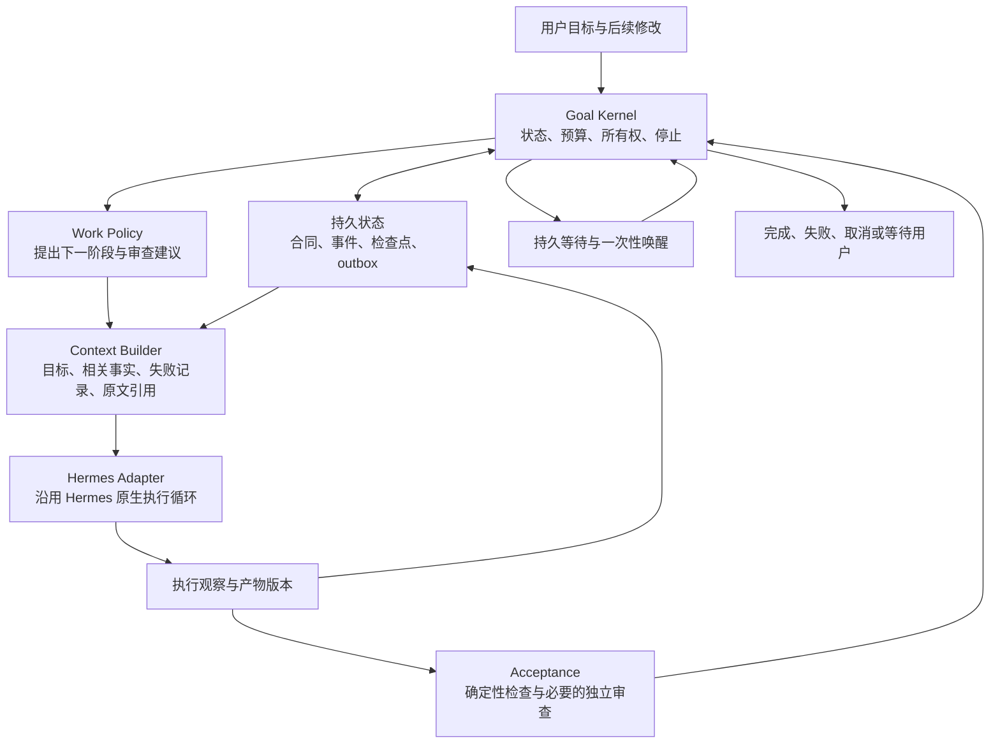

# Supergoal：近期 Harness 研究与 v2 架构建议

调研截止：2026-10-04。需求：持续推进一个有限目标，可以跨小时或天，完成后停止。本文是研究与设计提案，尚未实现或做真实模型对照实验。

结论：建议重构为 **Hermes 上的通用持久目标运行时**。稳定内核负责状态、恢复、预算和停止；可替换策略负责如何规划、组织上下文与选择验证时机。把长期任务身份、当前聊天上下文和模型的完成声明分开。

没有证据支持一套对所有模型、任务和预算都最优的 Harness。先进性应体现在边界清楚、可恢复、能衡量取舍，并且能够撤掉已经失去收益的策略。

## 1. 核验范围与证据强度

阅读了下列论文的方法、实验或消融部分，并检查了六个开源仓库的相关源码。源码快照保存在本地 `.git/harness-research/2026-10-04/`，没有安装、运行这些框架或复现其基准。提交号固定本次观察，不代表推荐部署版本。

| 开源项目 | 核验提交 | 核验内容与可借鉴之处 | 采用边界 |
| --- | --- | --- | --- |
| [LongHorizon-Harness](https://github.com/AMAP-ML/LongHorizon-Harness/tree/a1dd930614972b92361c1b9cd6aac441a6db5a65) | `a1dd930`，2026-08-20 | 外部任务状态、阶段执行、审查；阅读 manager、auditor、adapter 与注册表 | 论文提到 Hermes，但该提交主运行时注册的后端是 Claude Code、Codex、DeepSeek Harness、OpenCode；Hermes 相关文件位于随仓库附带的 WeaveBench 评测代码，不能视为现成的 Hermes 插件 |
| [Deep Agents](https://github.com/langchain-ai/deepagents/tree/f0159ce6b821ed4720cfa69d525c88434668b065) | `f0159ce`，2026-10-04 | 框架运行时、agent loop、middleware/profile 分层；上下文压缩和历史外置；可选 rubric 续跑 | 适合借鉴组合方式。直接引入会在 Hermes 外增加另一套模型、工具和会话执行层 |
| [OpenHands SDK](https://github.com/OpenHands/software-agent-sdk/tree/b66c724361571aa5c982883173c71b04739b247d) | `b66c724`，2026-10-04 | 追加事件日志与模型视图分开；服务端租约带递增 generation；另有目标控制器 | 目标控制器仍依赖 transcript Judge；不能把“另一个模型检查过”当成环境验证 |
| [Pi / pi-durable](https://github.com/earendil-works/pi/tree/200387122ca450d6387f033949423114a270b96c/packages/durable) | `2003871`，2026-10-04 | 原子提交、持久任务检查点、requestId 去重、工具执行前记录意图及重放规则 | README 明确标为实验性；与现有 Python Hermes 的集成成本需要单独评估 |
| [ACM](https://github.com/lixiaochuan2020/agentic-context-management/tree/f06f90e728af8580a4515812425c1620144145a2) | `f06f90e`，2026-08-03 | 活跃上下文与原始历史分开，压缩后仍可检索原始记录；包含训练流程 | 借鉴可追溯存储；模型学会主动管理上下文的收益不能由添加两个工具直接保证 |
| [OneDayAgent](https://github.com/zjunlp/OneDayAgent/tree/f29f6d496437c9ea7b8b5e8fe232d186b868b9f5) | `f29f6d4`，2026-08-15 | 分解、合成、最终产物检查和定向修复；阅读 workflow 与 verifier | 已公开代码。其运行方式和验证宽严度属于研究系统的配置，不能直接成为所有任务的验收标准 |

更具体的实现证据：

- Pi 在 [tool.ts](https://github.com/earendil-works/pi/blob/200387122ca450d6387f033949423114a270b96c/packages/durable/src/harness/tool.ts#L37) 持久化调用参数和重放属性；恢复时仅重跑被声明为安全的调用，其他调用返回可能部分执行的中断结果。这直接对应 Supergoal 的“派发后崩溃”窗口。
- OpenHands 的 [ConversationLease](https://github.com/OpenHands/software-agent-sdk/blob/b66c724361571aa5c982883173c71b04739b247d/openhands-agent-server/openhands/agent_server/conversation_lease.py#L101) 将 owner、到期时间、generation 分开，并提供受所有权检查保护的写入。其 [Condenser 设计](https://github.com/OpenHands/software-agent-sdk/blob/b66c724361571aa5c982883173c71b04739b247d/openhands-sdk/openhands/sdk/context/condenser/README.md#L13) 用压缩事件生成模型视图，原日志仍然保留。
- Deep Agents 的 [架构文档](https://github.com/langchain-ai/deepagents/blob/f0159ce6b821ed4720cfa69d525c88434668b065/libs/ARCHITECTURE.md) 和 [graph.py](https://github.com/langchain-ai/deepagents/blob/f0159ce6b821ed4720cfa69d525c88434668b065/libs/deepagents/deepagents/graph.py#L272) 显示 Harness 通过 middleware/profile 组合在原有执行循环上；[RubricMiddleware](https://github.com/langchain-ai/deepagents/blob/f0159ce6b821ed4720cfa69d525c88434668b065/libs/deepagents/deepagents/middleware/rubric.py#L2) 展示了有上限的验收反馈循环。
- LongHorizon-Harness 的 [后端注册表](https://github.com/AMAP-ML/LongHorizon-Harness/blob/a1dd930614972b92361c1b9cd6aac441a6db5a65/src/lh_harness/agent_registry.py#L66) 是本次兼容性判断的依据；论文的后端描述与当前主入口的直接支持范围需要分别核对。

## 2. 近期论文改变了哪些判断

以下是作者报告的结果，不能解释为已在 Supergoal 或用户服务器上验证。

| 研究 | 时间 | 对本项目有用的发现 | 证据限制 |
| --- | --- | --- | --- |
| [LongHorizon-Harness](https://arxiv.org/html/2608.01964v1) | 2026-08-03 | 管理—执行—审查分离；任务状态由环境证据支撑，执行上下文可以换新。论文报告不同任务的 token 成本有升有降 | 实验主要使用 Claude Code，也报告部分 Codex 配置；不等于验证腾讯云 Hermes。部分排行榜对照权限不同。OSWorld 上额外计算明显，不能归因于相同计算预算下的纯结构提升 |
| [OneDayAgent](https://arxiv.org/html/2608.05013v1) | 2026-08-04 | 最终交付物须回到原始请求做整体检查，再定向修复。表 3：DIRECT 得分 0.771、27.6 分钟；VERIFY 0.804、29.7 分钟；FULL 0.821、53.6 分钟 | 同模型消融很有参考价值，但只覆盖该 104 任务集；外部基线的模型及部分 Judge 设置不同。最高分配置不等于性价比最佳 |
| [ACM](https://arxiv.org/html/2607.23809v1) | 2026-07-26 | 压缩摘要保留原始记录引用，必要时回读；上下文管理可作为模型动作 | “无损”指原始记录仍可恢复，不代表摘要或检索不会遗漏。论文同时包含后训练，不能把全部收益归于运行时结构 |
| [An Empirical Study of Harness Design for Coding Agents](https://arxiv.org/html/2609.20804v1) | 2026-09-17 | 4 个模型、176 个设置中，规划、工具接口与压缩收益随模型和预算变化；先删减冗长观察再摘要较有效，额外 recall 在该实验中未提高准确率 | 研究特定编码模型与两个编码基准，不能推出研究、文档等任务均不需要检索；也不否定为恢复与审计保留原始事件 |
| [ContextEvo](https://arxiv.org/html/2609.34649v1) | 2026-09-28 | 根据轨迹分析输入组织、历史维护和上下文共享策略；把策略更新与固定运行约束分开 | 很新的预印本；文中跨任务环境迁移会退化，一些 held-out 条件也退化。本轮核验了论文，未独立定位并审计其完整发布代码，不作为成熟依赖推荐 |

一个关键分歧是：LongHorizon-Harness 强调阶段间换新上下文，而 Anthropic 的应用开发实验在换用更强模型后撤掉了强制 reset 和 sprint，并降低审查频率。这支持把它们设计成可替换策略，而不是内核不变量。该材料是工程案例，属于特定应用开发任务，不能当作通用基准结论。[Anthropic，2026-03-24](https://www.anthropic.com/engineering/harness-design-long-running-apps)

另外两个工程参照强化了分层方向：Anthropic 把持久 session 日志、Harness 与执行环境分开；Microsoft Harness 组合现有运行时能力，并将 bounded looping 等功能单独配置。前者是托管服务报告，后者文档仍将部分能力标为 experimental。[Anthropic，2026-04-08](https://www.anthropic.com/engineering/managed-agents)、[Microsoft Harness 文档](https://learn.microsoft.com/en-us/agent-framework/concepts/harness)

## 3. 对上一版重构方案的修订

保留上一版关于单一状态机、事务、幂等、租约和按条件验收的结论。新增三个必须有明确接口的职责：**阶段执行、上下文组装、策略评测**。

| 上一版重点 | 本轮补充 |
| --- | --- |
| 会话压缩后能继续 | 目标身份独立于会话；明确每一阶段应看到哪些事实、失败经验和证据 |
| Judge 按条件检查 | 检查结果关联产物版本；需要时重新读取环境，最终检查原始目标的整体覆盖 |
| 可选 Critic | 更一般的策略接口：是否分解、是否换上下文、何时审查均可替换与消融 |
| 有事件账本 | 区分控制事实、带来源的任务知识、可重建的模型上下文 |
| 任务完成率 | 同时衡量误判完成、完成后空转、缓存成本、恢复行为和策略迁移退化 |

这些是根据调研与本仓库反例提出的设计判断，尚不是实验结论。

## 4. 推荐架构

这些是同一个插件内的模块边界。当前单服务器可以继续使用 SQLite 和文件存储，通过现有 Hermes 服务承载派发与唤醒。

### 4.1 Goal Kernel：唯一控制权

输入持久事件和类型化结果，输出状态变化与待执行动作。内核不调用模型、不推断任务领域、不直接执行工具。

建议稳定状态：`ready / running / waiting / paused / succeeded / failed / cancelled`。预算耗尽、缺少输入、评估器失效和宿主能力不足分别记录原因；阶段内部的执行、验收进度另外记录，避免把所有组合塞进一个状态枚举。

它必须保证：

1. 同一事件或回合重复到达，不重复记账、评估或生成执行任务。
2. 同一目标只有一个有效执行 owner；过期 owner 不能提交新决策或派发。
3. 状态、事件游标、阶段结果与 outbox 在一个事务中提交。
4. 用户修改目标生成合同版本；旧版本的检查不能直接完成新目标。
5. 终态不再派发工作；结果交付失败只重试交付，不能重新驱动模型做任务。

事件日志用于恢复插件状态，不自动恢复外部世界。外部动作的重试需要幂等键、结果核对或明确的“不确定”状态。租约 fencing 只能阻止受该机制保护的操作；已经离开宿主的请求无法仅靠 SQLite 撤销。

### 4.2 Task State：权威要求、观察与建议分开

| 数据 | 谁能改变 | 用途 |
| --- | --- | --- |
| `GoalContract`：原始请求、后续修改、约束、验收条件、权限与预算 | 用户输入经内核版本化；解析结果须可追溯 | 定义到底要完成什么 |
| `RunRecord`：生命周期、owner/epoch、阶段、预算、等待句柄 | 内核 | 恢复和调度 |
| `Observation / ArtifactRef / CheckResult` | 宿主观察、验证器；带来源、时间与版本 | 支撑当前任务状态 |
| `WorkPlan / WorkingNotes`：计划、假设、未解决问题、失败方法 | 执行器或策略 | 帮助后续行动；本身不构成完成证明 |
| `ContextSnapshot`：某次请求实际可见的输入及引用 | Context Builder | 重现上下文问题、比较策略 |

自然语言请求仍然可以直接启动。由原文明确推出的条件可以结构化；模型提出的额外质量建议标为建议，不能自动成为阻止完成的硬门槛。计划中的子任务全部打勾，也不能代替整体目标检查。

原始观察可保留在 Hermes 日志或受管理的产物存储中，插件保存稳定引用、版本和必要快照。源记录不可恢复时标记缺口，不能宣称完整可重放。摘要、旧检查和知识条目都有适用范围；产物变化后重新判断有效性。

### 4.3 Episode：有边界的一段实际工作

一个目标由若干执行阶段组成。阶段包含一个当前意图、相关条件、资源上限和停止/等待信号；Hermes 在阶段内保留自己的规划与工具循环。

阶段不是一次模型调用，也不要求每次工具调用之后重新规划。可以是“完成一项修改并检查”，也可以是“获取材料并形成初稿”。复杂任务的下一阶段根据新事实动态选择，无需提前生成完整 DAG。

默认继续当前有效会话。到达交接点、上下文压力过高或需要审查隔离时，再通过宿主能力组装新上下文。保留必要的失败方法和未解决问题，避免新阶段重复探索。是否换新、何时换新都应通过实验选择。

`goal_id` 跨阶段稳定；`episode_id` 表示一次工作段；`session_id` 仅表示 Hermes 的物理会话。强制 fresh context 不是当前设计的默认条件。

### 4.4 Context Builder：从可追溯记录生成工作上下文

每次阶段交接至少保留当前用户要求、权限边界、尚未满足的条件、相关产物版本、关键失败经验、正在等待的资源，以及可回读的证据引用。

先采用成本低、易检查的手段：大工具结果外置，保留短预览及定位信息；控制重复内容；必要时再做摘要。先提供 ID、时间范围和关键词检索，复杂向量记忆系统需要收益证据后再增加。

原始历史保留服务于恢复、审计和按需回读；是否把检索工具暴露给模型、如何引导使用，是另一个需要测量的策略选择。保留数据与持续把全部历史灌入上下文是两个独立决策。

Hermes 仍拥有原生会话压缩。插件先负责交接包与任务投影，避免两个压缩器同时重写同一段会话；更深的上下文控制需要通用宿主接口。

### 4.5 Acceptance：验证结果后再提交完成

按条件选择检查方式：结构/计数/命令结果等用确定性检查；文意、逻辑和表达质量用语义评估；必须由人确认的事项才等待人工输入。

检查结果至少关联：`criterion_id`、`contract_revision`、`artifact_version`、`verifier_id/version`、`method`、`pass/fail/unknown`、证据引用和检查时间。语义评估要保留“模型判断”的性质，不能升格为确定性证明。

最终检查必须覆盖用户原始请求、约束与交付物之间的关系。确定性失败不能被 Judge 的总分覆盖；读取一个文件不能证明生成了目标文件；测试工具调用成功不能代替测试通过。纯文本任务可以用最终文本作为候选交付物，无需强加文件或工具要求。

独立审查使用单独上下文，并在需要时检查实际产物。工具权限由宿主限制；测试可能写缓存或启动进程，应在允许的检查环境或临时副本中运行，不能仅凭提示词声称“只读”。同一个模型换角色仍可能犯相关错误，因此是否增加第二审查模型须单独评测。

默认在执行器提交完成候选时做整体验收，阶段中优先检查已有低成本信号。停滞、冲突或重大交接可触发更深入审查。评估器超时/格式错误进入有限重试及退避；不能把“检查服务坏了”变成新的任务工作回合。

### 4.6 Work Policy：可替换的智能策略

策略返回下一步工作建议、依据与需要的检查；内核验证其是否满足目标版本、权限、预算和生命周期条件。无需为每一步固定配置 Manager、Executor、Critic 三次模型调用。

初期策略可以很简单：一个 Hermes 执行器，加完成候选验收与失败后的定向继续。复杂任务可以增加阶段分解或独立审查，保留同一内核。

技能负责领域方法。交易研究、代码开发、文献分析都可以有自己的可选技能和验证器，但不能给通用内核添加领域门禁，也不能用领域关键词擅自增加用户验收条件。

策略应有版本并固定于一次运行；升级或切换时有记录。后续可以离线分析轨迹并提出策略修改，经未参与调优的任务验证后发布。第一版不需要生产运行中自动改写自己的控制代码。

## 5. 等待、恢复与宿主接入

“跨天”依靠持久记录和事件唤醒。等待后台工作时保存可信的进程/任务句柄、目标版本、下一动作和可选超时；唤醒事件持久化并去重。等待期间无需模型轮询。

宿主重新启动后先核对未完成派发、后台任务和已经发生但未记账的动作，再决定继续、重试或暂停。只记录一个裸 PID 无法可靠区分同名进程和 PID 重用。

预算区分实际推理用量、重试、活跃执行时间与墙钟截止时间。等待不能被计为模型工作回合；开始工作前预留可配置的验收预算。费用数据不足时区分估计值与实际值，不能声称精确费用上限。

HermesAdapter 至少需要下列能力契约：

| 能力 | 对 Supergoal 的作用 | 能力缺失时 |
| --- | --- | --- |
| 稳定回合/调用 ID 与实际结果、用量事件 | 幂等、证据与预算 | 明确可用范围，不伪造可核对的数据 |
| 带 request ID 的执行派发及状态查询 | 核对宿主是否已接收，处理崩溃窗口 | 状态不明时核对或暂停，不盲目再执行 |
| 用户暂停、取消与执行所有权 | 阻止过期结果和重复续跑 | 相应自动运行模式不能启用 |
| 持久后台完成事件与一次性唤醒 | 重启后等待恢复 | 明确只支持人工恢复，或补通用宿主能力 |
| 会话 lineage、阶段交接、上下文引用 | 跨压缩/会话保持任务身份 | 先使用原会话，暂不承诺跨会话阶段执行 |
| 检查工具的权限范围 | 对实际产物做独立检查 | 使用受控验证器，不能把提示词当隔离机制 |

已核验的服务器基线是定制 Hermes v0.21.3，存在上游固定版本没有的插件控制接口，详见 [兼容性审计](compatibility-audit-2026-10-04.md)。上述能力是 v2 的需求清单，不能理解为该服务器已全部实现。

同一目标只能有一处续跑控制。接入时必须明确原生 `/goal` 与 Supergoal 谁负责驱动该目标；不要让两个目标循环同时派发。优先复用宿主提供的工具、会话、进程和调度能力，需要的扩展保持为通用接口。

## 6. 用什么证明重构有效

把工程可靠性与模型任务质量分开验证。

**可靠性**使用确定性故障注入，沿真实插件入口覆盖：重复回合、双 owner、提交前后崩溃、派发结果不明、迟到事件、等待时重启、压缩、用户改目标、取消后回调、超过 1,000 条日志、验收服务故障和产物版本过期。要求不重复耗账本预算，不复活终态，等待可恢复，不因失效检查继续做无关工作。外部副作用的不确定性必须显式记录。

**任务质量**选择代码修复、文档交付、资料综合、数据处理、长后台工作等有限目标，并加入无法完成及必须等待输入的任务。验收依据任务本身，避免在评测中再次嵌入交易或编码专属规则。

对照组：Hermes 原生 `/goal`、当前 Supergoal 候选、仅新内核、内核加阶段/上下文策略、再加独立审查。先做小规模配对试验，再依据结果增加样本，不一次开启全部新组件。

各组使用相同任务初始环境、模型版本、工具权限与总资源上限，计算规划/摘要/审查的全部开销；同时报告实际消耗。必要时报告质量—成本曲线，避免把额外计算带来的收益全部归因于结构。评测用的结果检查与运行时 Judge 分开，对语义任务抽样人工复核。

主要指标：真实达标率、误判完成率、达标后的多余回合、成本/成功任务、耗时、等待恢复延迟、重复副作用、上下文遗漏与无进展重试。长时间浸泡测试覆盖实际等待和进程重启；一次成功案例不能证明跨天可靠性。

## 7. 建议实施顺序

1. **先修内核。** 将上轮反例固化为回归，统一控制路径，补齐回合去重、账本游标、执行所有权、等待唤醒、评估失败语义和版本化验收。
2. **再增加阶段和上下文接口。** 保持外部命令兼容，在 RuntimeManager 内逐步委托新模块；验证同会话延续，再验证跨会话交接。
3. **增加独立产物检查。** 先确定性验证器，再给语义任务配置评估；用真实任务校准误判和额外成本。
4. **做配对消融。** 据结果决定哪些模型/任务需要更强规划、换新上下文或更多审查。策略演化留到有足够轨迹和独立评测之后。

建议模块边界为 `kernel/`、`contracts/`、`context/`、`policies/`、`verification/`、`adapters/hermes/` 和 `storage/`。它们可以逐步落地，不要求同时创建完整抽象层。

当前值得保留的基础是 Hermes 执行生态、SQLite、稳定目标 ID、事务/CAS 和 outbox；需要重新设计的是控制权、验收语义与上下文交接。现有 `85 passed` 的候选测试不能证明本文方案已成立，生产环境也尚未部署本文提案。
