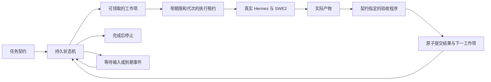

# Supergoal 的实验版内核与证据边界

日期：2026-10-05。实现位于 `supergoal_runtime/v2/`，仍是实验引擎；默认插件继续走原来的入口。

本文件记录第一轮冻结的 r3 架构及其证据边界。后续本地候选已新增显式配置的插件入口和验收审查流程，见 [v2 插件入口与验收审查](v2-plugin-and-acceptance.md)；这些新增实现不回填为 r3 实验已经验证过的功能。

研究目标是检验：在相同 Hermes、模型、工具和资源上限下，Supergoal 是否提高有限目标的独立验收完成率，降低虚假完成，并能在真实等待和进程重启后正确继续。实验允许出现无提升、退化和失败。

## 实际落地的机制

- SQLite 同一事务保存任务状态、结果收据、事件和下一工作项。重复提交不会再次消耗轮数或再建工作项。
- 执行租约绑定 owner、epoch 和过期时间；并发领取、取消后返回、过期执行者提交均不能越过状态检查。
- 已运行但结果不明的工作项进入 `needs_reconciliation`，不会盲目重放可能已有副作用的工具操作。当前版本只自动恢复已提交边界后的未执行工作。
- 等待是持久状态，唤醒事件也去重；等待期间不调用模型轮询。
- 任务契约给出产物和验收命令，内核不包含任何行业流程。验收读取真实文件 SHA-256 和子进程退出码，检查前后文件变化会使验收失败。
- 不存在验收配置、验收超时或程序启动失败时，结果为 unknown，停在 `verification_unavailable`，不能宣布成功。
- 从候选 r2 开始，控制数据库位于执行器文件系统之外；执行器退出后，单独的进程在只读产物上运行公开验收。隐藏评分器不向执行器返回反馈。
- 可移除的上下文机制只补充目标、剩余轮数和最近公开验收结果。完整历史保留；本版没有声称实现上下文压缩或自动记忆优化。

这里的 `succeeded` 表示某个产物版本通过了**配置的契约检查**。若检查不完整，仍可能与隐藏任务验收不符。因此基准的隐藏评分与运行中的验收是两套程序，必须统计虚假完成。

## 对照实验怎样解释

`hermes` 是一次原生工具循环；`native_goal` 使用服务器安装版本的真实 GoalManager；`sg_v1` 使用研究开始前冻结的代码；另有完整 v2、移除状态补充、移除验收三组。每组收到相同任务要求和独立工作区；旧版自身的启动板、自动轮前缀及各组后续提示差异属于干预的一部分，计入 token 开销。

所有组共享 48 次执行器调用、60 次物理请求、6 个外层工作轮和 20 分钟上限。一次原生 Hermes 循环可用完整剩余执行预算。传输重试同样占用物理请求预算。执行器输出上限 3000 token；原生和旧版评估器保留自身逻辑，额外开销全部记账。

初次开发试跑暴露 Hermes 默认流式事件空闲超时仅 12 秒，会中断 SWE2 的长间隔返回。原始试跑完整保留。之后统一设定 90 秒流式空闲、首事件和读取超时，并注明这是实验环境修正。不得用修正前后的不同组成绩宣称机制优势。

开发试跑还发现旧版驱动器缺少自动启动信封，使旧版误判为用户抢占。这些 v1 行标为无效集成对照。修正后通过旧版自己的 `start_for_command` 创建并领取初始 continuation，重新运行；不能把装置错误计为旧版算法失败。

开发任务的种子为 1101、1102。保留任务种子为 7201、7202、7203；在运行前冻结生成器、任务散列、评分器、实现、提示和预算，之后不根据该批结果调参。不同种子只是同一任务族的变体，不能当作丰富的真实世界独立任务。

## 尚未证明的事项

1. 受控代码修复、数据整理、文档事实提取的结果不能外推到任意开放任务。文档评分主要验证结构化事实；自然语言简报的整体质量尚不在自动评分范围内。
2. 同一任务一轮即完成时，上下文消融没有受到有效检验；应报告天花板效应，不能把几组全对解释为机制必要。
3. 两小时分阶段输入实验主要验证时间跨度、等待、进程重启和最终正确性。必须分别报告模型实际工作时间和等待时间，不能声称两小时持续推理。
4. 当前 v2 通过独立进程驱动真实 Hermes AIAgent，尚未接入生产 Gateway 的 slash-command/调度流程。v1 使用真实 PluginContext 和 turn-controller ABI；这两种集成层级必须区分。
5. 断电后的工具外部副作用去重、开放任务语义验收、上下文压力场景、24 小时实验和公开基准复现仍需额外证据。

正式研究报告需要更多独立任务、重复采样、任务级配对置信区间，以及公开可复现基准。第一轮结果仅用于验证实验装置、发现故障和决定下一轮设计。
